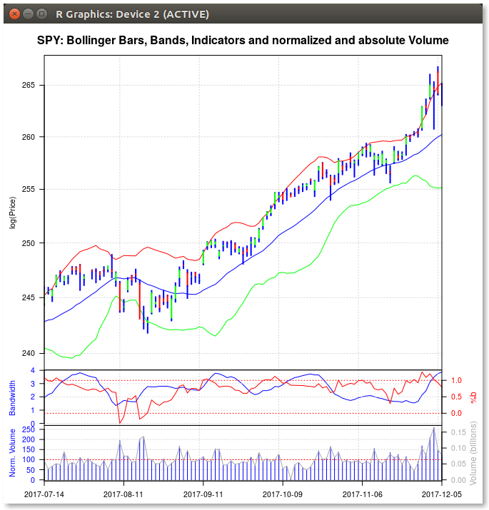

## bbb

Borked Bollinger Bands (in the presence of dplyr)

### What is it?

This repo contains some code I wrote in July 2005 in discussions with
[John Bollinger](http://www.bollingerbands.com). It replicates the output of some code he had sent
me (in another language, and with a plotting tool, I shall not name ;-) using just R.

This code "just worked" for a dozen years.

### What does it do?

BollingerBands are, in essence, a moving average with upper and lower bands based on standard
deviations. Hence moving average calculations are important and implemented here using a standard
trick with a call to `filter()` (using only one-side).

To see an example, just try it:

```r
library(bbb)
BollingerBands("SPY")    ## using SP500 Index ETF with default values
```

and a chart like the following should be produced showing adaptive bands around open/high/low/close
bars, two "bandwidth"" measures as well as normalized and absolute trade volume.

  

### And now?

One thing is that Yahoo!, in all their wisdom, finally turned off the csv interface we all use for
this long (and longer...).  So I switched to using 
[quantmod](https://cran.r-project.org/package=quantmod); the remainer is unchanged.

### So what about dplyr?

[dplyr](https://cran.r-project.org/package=dplyr) chose to mask `stats::lag` and `stats::filter`.
So this code broke as `stats::filter`, the basic filtering function in R, is now shadowed by a
completely different one. Which breaks the code. Ouch.

Until, or unless, you do what we currently have in `NAMESPACE`:

```r
importFrom("stats", "filter")  # this protects filter from being harmed by a later load of dplyr
```

which is functionally equivalent to always explicitly calling `stats::filter` instead.

But If you comment out that line, rebuild/reinstall and then load
[dplyr](https://cran.r-project.org/package=dplyr): BAM. Borked code. What used to work no longer
works.

Of course, some disciples of [dplyr](https://cran.r-project.org/package=dplyr) may claim that it was
our fault and that we need to change our code. I beg to differ. New code should not exhibit side
effects on existing code---the very reason we do such extensive reverse-dependency checks around
CRAN.

### What else?

There is/was hope that adding a constraint to the `importFrom` or `import` statement may help.
I tried the following (which is currently commented out in the repo)

```r
## this does NOT work (and of course also needs DESCRIPTION entry)
import("dplyr", except=c("lag", "filter", "filter_")) 
```

but alas it did not help. I would love to hear from anyone who can make it work.

### Author

Dirk Eddelbuettel

### License

GPL (>= 2)


